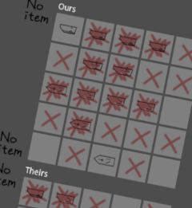
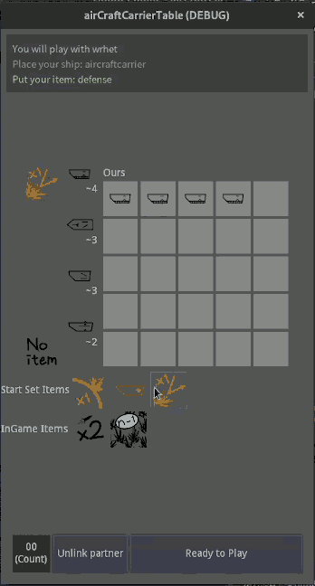

# [프로토타입] 항공모함 게임 체험 페이지
Very first prototype playing is now available  
  

## 설명은 필요없고 게임하게 해줘요
[한국 서울시 서버](http://3.35.210.70) (현지시간 10월 29일에 종료)  
[미국 버지니아주 북부 서버](http://34.207.166.150) (현지시간 10월 28일에 종료)

> **현재 버전에서 발견된 버그들**  
> - [ ] 방어 아이템을 장착한 채 배치하지 않으면 해당 플레이어의 패배처리가 동작하지 않음  
> - [ ] 반격 아이템 반응시 반격 당하는 쪽에서 패배처리가 동작하지 않는 현상이 확인됨
> - [ ] 함선과 바지선 1척씩 남은 상태에서 바지선이 피격당하면 게임이 패배하는 문제가 확인됨
> - [ ] 반격시 미스샷 처리되는 경우가 종종 발견됨
> - [ ] 보호막이 제대로 동작하지 않는 경우가 발견됨

서버 운영은 11월 1째주에 수정을 거쳐 다시 운영될 예정입니다.

## 게임에 대해서
* 평균 5분 내외의 짧은 플레이 시간을 가지고 있습니다.
* 현재 함선의 임시 아이콘은 Planetary Annihilation 시리즈에서 따왔습니다. 디자인 컨셉이 준비중으로 지금은 최소한의 모양새만 갖추고 있어 보기 불편할지도 모르겠습니다. 양해 부탁드려요.
* 인터페이스가 매우 구려서 PC보다는 휴대폰으로 접속할 때 조작이 편합니다.

**How to play**

운영중인 서버에 접속하면 로딩 후 화면이 보이게 됩니다.  
진행 표시 줄이 완료되었는데 검은 화면이 보이신다구요?  
조금만 더 기다려주세요, 곧 화면이 보일겁니다.

  
가장 오른쪽 입력란에 이름을 입력하고 'Join Server' 버튼을 누르면 서버에 입장하게 됩니다.  

* Join server를 누를 때 이름 입력 때 보였던 창이 보이는 버그가 확인되었습니다. 화면의 다른 부분을 누르거나 새로고침을 통해서 해결 된다고 합니다. 이용에 불편을 드려 미안합니다.

  
접속한 상태에서 오른쪽 아래 'PlayWith' 버튼을 누르면 같이 게임할 친구를 고를 수 있습니다.  
친구가 보이지 않을 때는 접속할 때까지 기다리거나 'Playwith' 버튼을 다시 눌러주시면 리스트가 보이게 됩니다.  
같은 서버에 접속한 사람 리스트에서 이름을 선택하고 'Let's Play' 버튼을 누르면 두 사람은 게임 준비 상태가 됩니다.

  
친구와 연결되면 배와 아이템을 배치합니다.  
배는 수직, 수평, 대각선으로 배치할 수 있습니다.  
배 아래 숫자는 배의 길이입니다.

> **잘 안되는 것 같을 때**  
> * 배가 잘 배치되지 않는 것 같다면 오른쪽 표에 배를 배치하고, 왼쪽 아이콘(아이템이나 배)을 선택하고를 교차하며 진행해보세요.  
> * 게임이 끝나고나면 'Unlink partner' 버튼을 눌러 상대와 연결을 끊고 재연결해야합니다.  
> * 설치형 아이템은 선택만하고 의도적으로 배치하지 않을 수 있습니다. 사용을 원한다면 반드시 맵에 설치해주세요.

아이템은 설치형 아이템과 게임중 사용 아이템 각각 1개씩을 고를 수 있으며  
1회만 동작/사용할 수 있습니다.  
각 아이템의 효과는 다음과 같습니다.

  
**방어**  
이 지역이 공격 받을 때 공격을 1회 무효처리 합니다.  
상대방 지도에는 공격한 흔적이 남지 않습니다.  
반격으로 공격받은 경우에는 방어할 수 없습니다.

  
**바지선**  
전투 기능이 없는 배 한척을 배치합니다.  
탄을 맞을 경우 피격 판정에 영향을 주지만 승패와는 무관한 배입니다.

  
**반격**  
이 지역이 공격받을 때 상대방의 같은 지역에 반격합니다.  
상대측에서는 피격여부가 보이지만
아이템 사용자는 피격여부와 상관없이 맞은 것으로 보여줍니다.  
반격은 사전에 준비된 방어를 무시합니다.

  
**연속발포**  
이번 턴에 2회 공격을 실시합니다.  
2발 모두 적중되지 않으면 불발처리 됩니다.

  
**특탄**  
이번 턴에 적 함대의 남은 수보다 1발 적게, 무차별 포격을 가합니다.  
모든 탄이 적중되지 않으면 불발처리됩니다.

프로토타입 버전에서는 먼저 준비한 사람이 먼저 시작합니다.  
이 점을 이용하여 친구와 순서를 정하고 게임할 수 있습니다.

## 개요
> 오랜 옛날부터 해오던 항공모함게임을 이제 휴대폰으로 즐길 수 있습니다.  

이 게임은 원래 [베틀쉽](http://en.battleship-game.org/)이라는 이름의,  
최소 8x8 이상으로 시작하는 게임입니다.

초등학교 때 갔던 어떤 수련회에서  
누군가의 제안으로 몇판했는데 재미있던 기억이 있습니다.

현재의 5x5 형태, 대각선 배치를 허용하는 규칙은 취향에 맞게 직접 개편한 규칙입니다.  
놀거리가 없을 때 비석차기를 하면 재미가 있듯,  
제한된 환경(수련회 같은 곳..)에서 종이와 펜만 가지고 시작할 수 있는 간단한 게임이고 짧고 즐기고 지나가는 게임이었습니다.

이 게임을 전자게임으로 옮기는 과정에서 아이템과 같은,  
전자기기이기에 편하게 이용할 수 있는 기능들을 추가하며  
보다 좋은 모양새를 갖추게 되었습니다.

추억으로 시작한 이 게임이 작은 인디게임으로,  
게임 제작자들의 게임개발경험과 사용자들의 소소한 즐거움으로,  
많은 사람들에게 좋은 영향력이 되기를 바라며..

## 제안사항 / 오류보고
여러분의 게임 경험은 어땠나요?  
어떤 부분이 재미있었나요? 아니면 지루했나요?  
플레이 후기를 남겨주시면 개발에 참고하겠습니다.  

[여기를 눌러 작성하기](https://is2you2.github.io/suggestion/)

## 핑계거리
**[개발 속도가 느림]**  
이 게임의 제작자들은 낮에 회사에 다니는 등 일상을 사는 사람들로  
게임제작 자체는 매우 더디게 진행되고 있습니다.  

**[서버가 느리거나 서버운영이 임의적임]**  
개인 사비로 운영되는 작은 서버로 필요할 때 탄력적으로 운영중입니다.  
프로토타입 기간동안 주요 업데이트나 버그 수정이 있을 때 서버를 운영할 계획이고  
알파버전부터는 사용자 사설 서버를 통해서도 게임을 즐길 수 있도록 계획하고 있습니다.  
프로토타입 기간에 임시서버가 개설되면 이 페이지에 링크를 생성할 예정입니다.

## 누가 만들고 있나요?
프로그래밍: [최성수](https://is2you2.github.io/)  
그래픽: [이동진](https://www.artstation.com/asjffdlasfj)  

도움주신 분들: [이해준](https://itholic.github.io/)